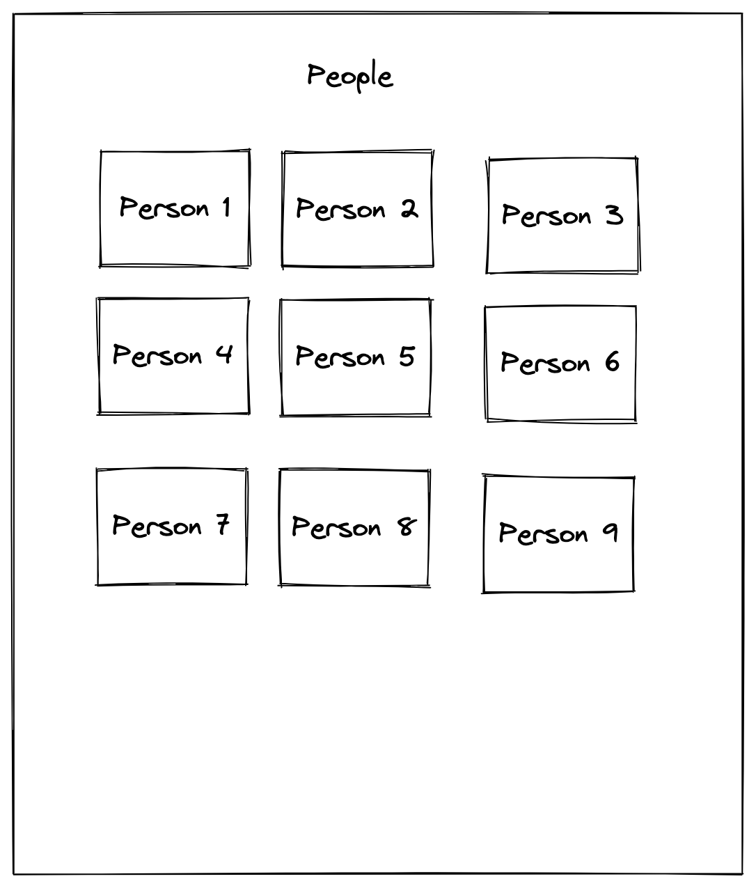
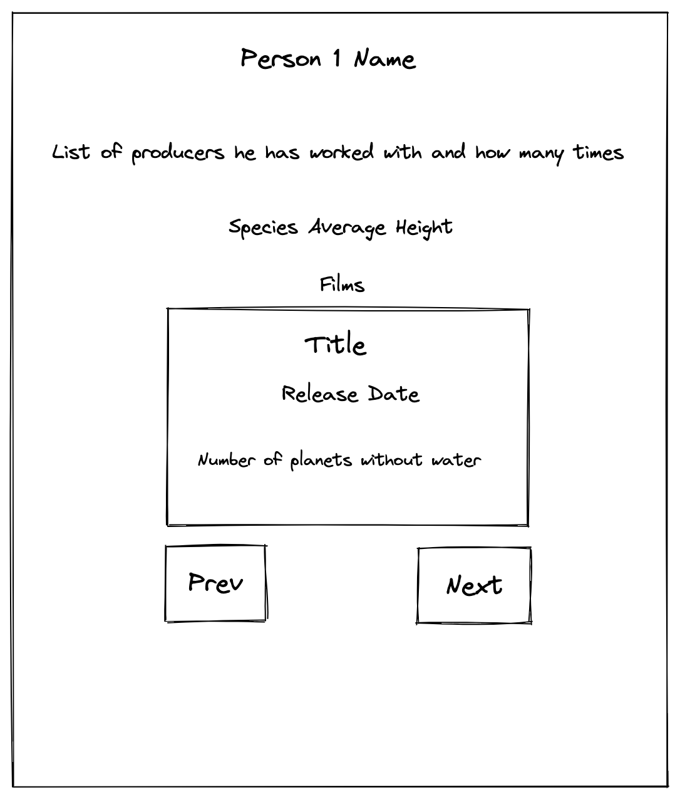

# vls code challenge

Live view: [https://vls-cc.vercel.app/](https://vls-cc.vercel.app/)

## Requirements

- List all people from the Star Wars API, each person linked to their detailed page.
- On the detailed person page, include:
  - A list of producers the person has worked with and the number of times.
  - The person's birth year.
  - The average height of the person's species.
  - A paginated list of the person's films, including:
    - Title.
    - Release date.
    - Number of planets without water in the film.

## Achievements

- List all people, live view [here](https://vls-cc.vercel.app/). Includes a call to action to load more elements. When fetching is performed, a skeleton is shown.
- Person detail page, live view [here](https://vls-cc.vercel.app/person/cGVvcGxlOjg=). Displays required information and includes a call to action (if available) to load more films.
- Used shadcn/ui with Tailwind for styling and UI components in general. Basic responsive UI

## Future improvements

- Add more unit tests for the hooks and test some visual components (person-card.component.tsx)
- Add integration and E2E tests to ensure correct behavior
- Improve TypeScript types
- Add a button on the home page to switch the query and load all persons
- Cover all error states
- Implement Eslint check correctly

## Assessment detail description

<details>

<summary>Click here</summary>
  
  # Code Test

  ## Assignment

  The application is setup with React Router containing two routes. The goal of
  the assignement is to create these two pages based on the mockups mentioned in
  each page section.

  The data is fetched from
  [Star Wars API](https://studio.apollographql.com/public/star-wars-swapi/home?variant=current)
  with the already setup [urql](https://formidable.com/open-source/urql/) client.

  The styling method is free of choice, it could be with css, scss, css-in-js or
  other preferences.

  - `/` - the home page
  - `/person/:personId` - the person page

  ### Home page

  This page should list all the people from the Star Wars API. Each person should
  be linked to its own page.

  

  ### Person page

  This page should contain overview of the player

  - List of producers the person has worked with and how many times.
  - Birth year
  - Person species average height.
  - Paginated list of person films containing:
    - Title.
    - Release Date.
    - Number of planets without water in the film.

  

  ## Setup

  Install dependencies (using NPM)

  ```bash
  npm run install
  ```

  Download GraphQL Schema

  ```bash
  npm run download-schema
  ```

  Generate GraphQL Types (generated types will be in `src/generated/graphql.ts`

  ```bash
  npm run codegen
  ```

  Start dev mode

  ```bash
  npm run dev
  ```

</details>
